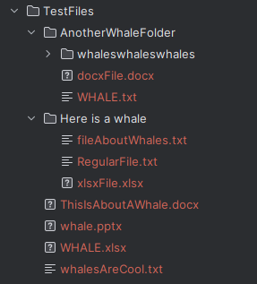
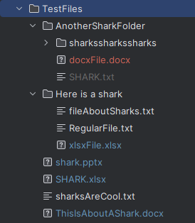
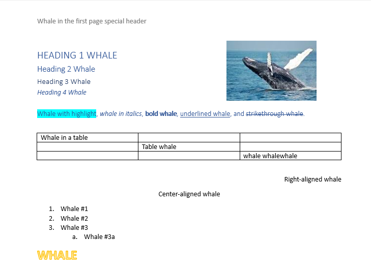
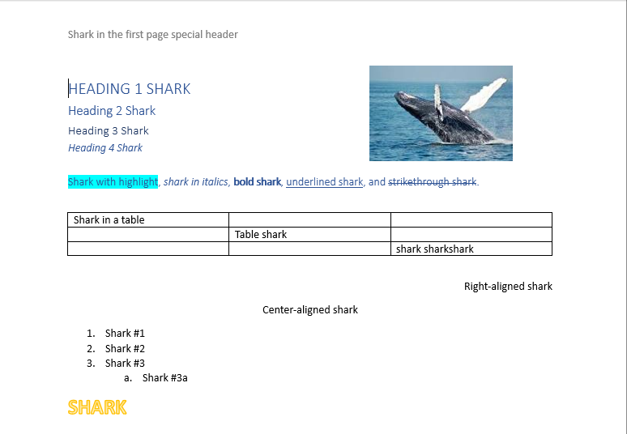
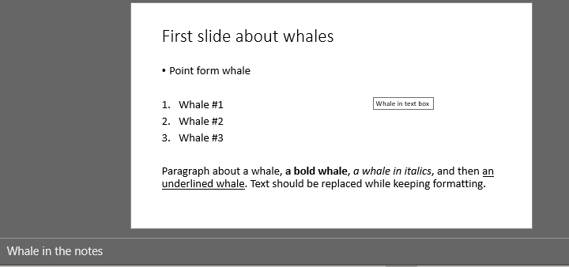
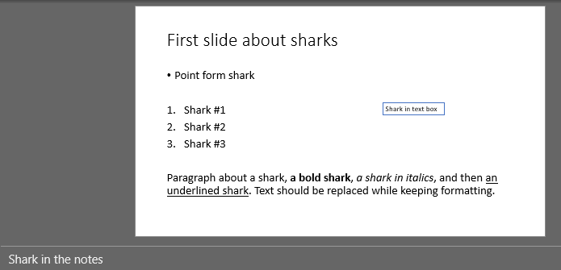
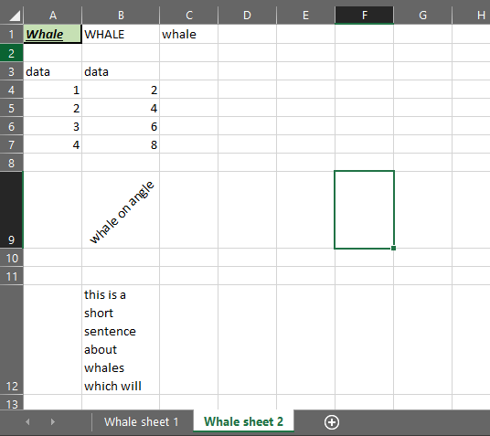
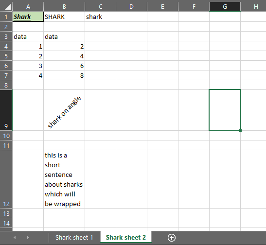
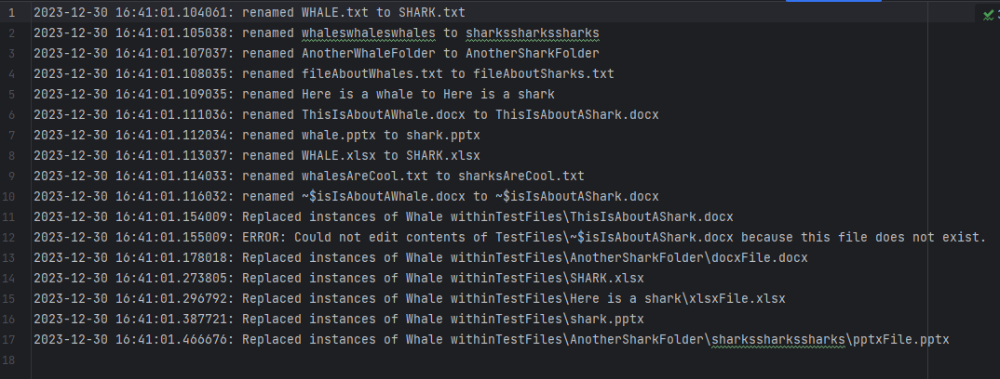

## Overview:
This program finds instances of a given word within a directory and replaces it with another given word. 
It finds and replaces within file and folder names, as well as contents of .docx, .xlsx, and .pptx files (without 
changing existing file formatting.)

## Method:
1. Recursively search through all files and folders in the directory using DFS and rename items that contain the old 
word, replacing it with the new word. 
2. Recursively find all files in the directory that end in .docx, .xlsx, and .pptx
3. Iterate through all found .docx files. For each document, iterate through all runs (sections of text with the same 
formatting), table cells, headers, and footers. For each of these items, find instances of the old word and replace with
the new word. 
4. Iterate through all found .pptx files. For each presentation, iterate through all slides. For each slide, iterate 
through all runs (sections of text with the same formatting), and check the slide notes. For each of these items, find 
instances of the old word and replace with the new word. 
5. Iterate through all found .xlsx files. For each workbook, iterate through all cells and also check the sheet title.
For each of these items, find instances of the old word and replace with the new word. 
6. Output a log of all events to file. 

## Packages Used & Why:
- docx -- for editing .docx files
- openpyxl -- for editing .xlsx files
- pptx -- for editing .pptx files
- os -- for navigating through the directory and obtaining + editing file information
- glob -- for finding all files with a given extension within a directory
 
## Example Results:
Below are some example results after replacing "Whale" with "Shark" within the TestFiles directory. 

#### Directory Contents - Before and After:

 

#### Word Document - Before and After:

#### PowerPoint Presentation - Before and After:

#### Excel Workbook - Before and After:

#### Log File:

## Limitations of This Program:
- Cannot be used to edit .pdf, .txt, or any other types of files besides .docx, .pptx, and .xlsx files
- Cannot find and replace within chart elements e.g. axis labels
- Cannot find and replace within comments
- Cannot find and replace within text boxes in .xlsx and .docx files (but CAN in .pptx files)